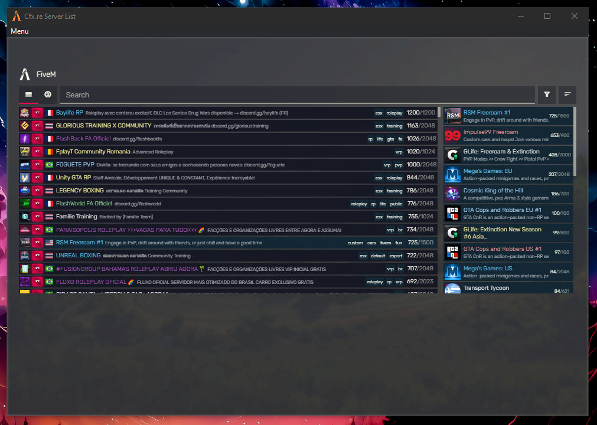

How To Use?   
Download a verson from [HERE](https://github.com/zf9/FiveM-Launcher/releases)   
Extract it to a folder.   
Run Test.exe
    

    
How To Compile?   
Add My Discord and ill help ZF9#7655   
am to lazy to type it here
